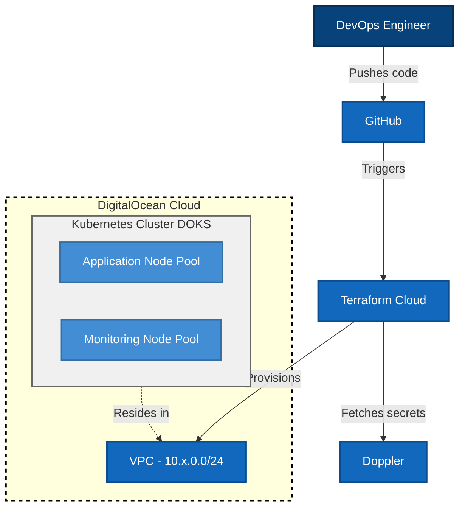
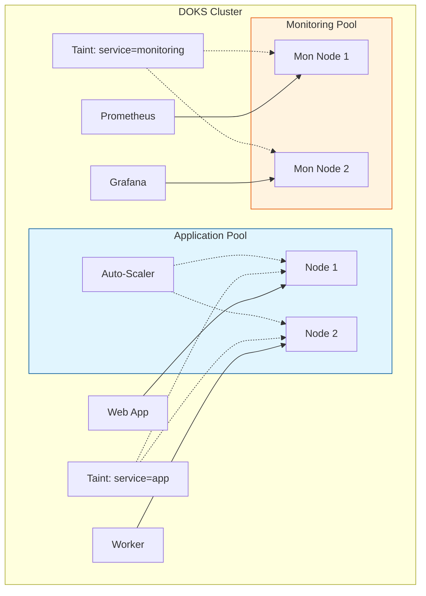

# Architecture Diagrams

## High-Level Infrastructure

This diagram illustrates the high-level infrastructure components managed by this project on DigitalOcean.

## Kubernetes Node Pools Strategy

We use a dedicated node pool strategy to isolate monitoring workloads from application workloads to ensure observability stability during high load.

